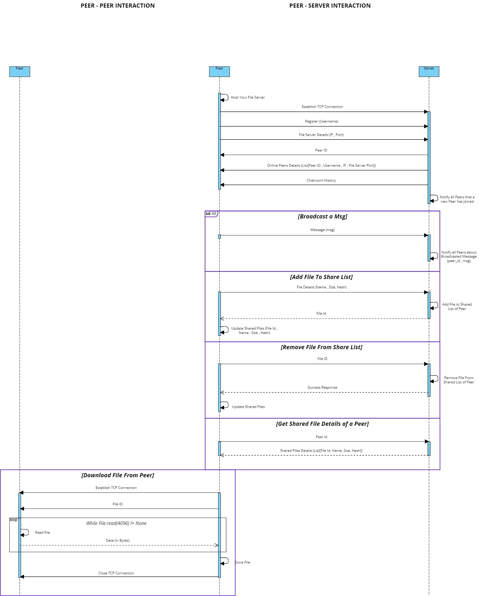

# Demonstration
https://github.com/HSR47/LANit/assets/116683673/995608c5-2c23-4dc7-9333-d522c5a0d139

# Setup Guide

1. Open the setup (`LANit Installer.exe`).
2. Setup will automatically LANit in your system.
3. After installation, you will find the LANit executable on your desktop.

**Requirements:**
Windows OS 

**Note:** 
If you try to 'Connect' or 'Host Server', it may happen that your antivirus might stop and block `main.exe` from executing. This `main.exe` is the backend (Python) part which needs to run for LANit to work. If it does get blocked, mark the `main.exe` as safe in your antivirus program, then restart LANit. (I SWEAR it's not a virus.)

# Technology Used

**Backend:** Python, FastAPI  
**Frontend:** JavaScript, Electron, Svelte, DaisyUI

# Architecture

## Backend

The core functionality of LANit is to enable a user to download files from another user present in the same local area network directly without an Internet connection or any third-party servers. This indicates that we need a Peer-to-Peer architecture where each peer will have a server-side that continuously listens on a port for requests from other peers and a client-side that sends requests to other peers.

But wait, how will a peer know how many other peers are present in the LAN, what their IP addresses are, what port they are listening on, and what files they are sharing? There are multiple ways to solve this problem, but the solution used in this project is to introduce a centralized server that stores the IP address, port, and shared files metadata (like File Id, File Name, File Size, File Hash) of each peer and lets every other peer know about it.

The detailed interaction between Peer-Server and Peer-Peer is depicted in the image below.

## Frontend

This is the part where things get weird. There are multiple frameworks that can be used to build desktop GUIs in Python like Tkinter, wxPython, PyQT, and so on. But I couldn't use any of them as I am more comfortable with HTML, CSS, and JavaScript for developing UIs. So, I decided to use Electron for this project. But there's a catch: in Electron, we are supposed to write our backend in JavaScript too. But by this time, I had already developed the backend logic in Python and didn't want to do it all over again in a different language.

So this is what I did to integrate Python and Electron together:
1. I first incorporated a FastAPI server in the Python backend that will run on localhost (127.0.0.1) and will be used for inter-process communication between Electron and Python.
2. This FastAPI server exposes necessary endpoints that will be used by the frontend (like 'Broadcasting a Msg', 'Downloading a File', etc.).
3. I also created an endpoint for websocket connections that will be used by the backend to send notifications to the frontend (like 'a message has been received', 'download progress update', etc.).
4. Then I packaged the Python backend into a single executable (`main.exe`) using PyInstaller so that the target machine on which LANit will run won't need to have Python and other dependencies installed. (Told you it's not a virus.)
5. This `main.exe` is then used by Electron to create a subprocess that will start the FastAPI server in the background.
6. I also made sure that whenever the user closes the application, the Python subprocess is killed too so that there won't be any memory leaks or dangling processes running in the background.

After all this weird stuff was done, all that was left to do was to create the UI for which I used Svelte.
